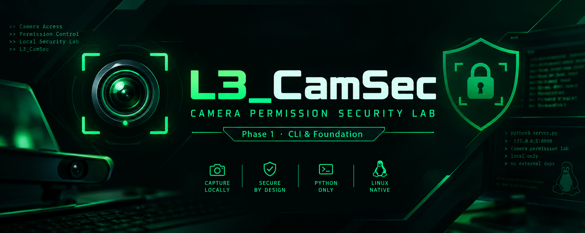

<div align="center">



<br>

# L3_CamSec

**Camera Permission Security Lab**

[](https://www.python.org/)
[](https://github.com/l3abouch/L3_CamSec)
[](https://github.com/l3abouch/L3_CamSec)
[](https://github.com/l3abouch/L3_CamSec)
[](LICENSE)
[](https://github.com/l3abouch/L3_CamSec/releases)
[](https://github.com/l3abouch/L3_CamSec/stargazers)
[](https://github.com/l3abouch/L3_CamSec/commits)

*A local security laboratory for understanding browser camera permissions, access control, and image capture behavior — in a fully controlled environment.*

</div>

---

> ⚠️ **IMPORTANT**
>
> L3_CamSec is designed exclusively for **educational use** and **authorized security testing**.
>
> Use it only on systems, browsers, and devices **you own or have explicit permission to test**.
>
> The author is not responsible for any misuse of this project.

---

## 📋 Project Information

| Property        | Value                                   |
| --------------- | --------------------------------------- |
| Version         | 1.0                                     |
| Languages       | HTML 45.2% · Shell 39.6% · Python 15.2% |
| Server          | Python HTTP Server                      |
| Default Address | `127.0.0.1:8080`                        |
| Platform        | Linux                                   |
| Network Scope   | **Local only** (`localhost`)            |
| Dependencies    | Python standard library only            |
| Status          | Active                                  |

---

## ✨ Features

| Feature                           | Description                                                          |
| --------------------------------- | -------------------------------------------------------------------- |
| 🎥 **Camera Permission Demo**     | Demonstrates how browsers handle camera permission requests          |
| 🖼️ **Local Image Capture**       | Captures images and saves them locally — nothing leaves your machine |
| 💾 **Local Storage Only**         | All runtime data stays on the local machine                          |
| 🌐 **Built-in Web Server**        | Lightweight Python HTTP server — no external tools needed            |
| ⚙️ **JSON Configuration**         | Fully configurable through `config/config.json`                      |
| 🔒 **Localhost Binding**          | Bound to `127.0.0.1` by default                                      |
| 🐍 **Zero External Dependencies** | Uses only the Python standard library                                |
| 🐧 **Linux Native**               | Designed for Linux security lab environments                         |

---

## 🗂️ Project Structure

```text
L3_CamSec/
│
├── config/
│   └── config.json           # Laboratory configuration
│
├── server/
│   └── server.py             # Python HTTP server
│
├── web/
│   ├── index.html            # Camera permission interface
│   └── continue.html         # Post-permission laboratory interface
│
├── L3_CamSec-Banner.png      # Project banner
├── l3_camsec                 # CLI launcher
├── .gitignore                # Excludes local runtime data
└── README.md
```

> Local runtime data — including session logs and captured images — is excluded from Git via `.gitignore`.

---

## 📦 Installation

Clone the repository:

```bash
git clone https://github.com/l3abouch/L3_CamSec.git
cd L3_CamSec
```

Make the launcher executable:

```bash
chmod +x l3_camsec
```

Start the laboratory:

```bash
./l3_camsec
```

Then open your browser:

```text
http://127.0.0.1:8080
```

---

## ⚙️ Requirements

* Linux distribution
* Python 3
* Modern web browser with camera support
* Connected camera or webcam
* Localhost access (`127.0.0.1`)

No external Python packages are required.

The project uses only the Python standard library.

---

## 🧭 How It Works

```text
[ ./l3_camsec ]
       │
       ▼
[ Python HTTP Server starts on 127.0.0.1:8080 ]
       │
       ▼
[ Browser loads index.html ]
       │
       ▼
[ Browser requests camera permission from user ]
       │
       ├── Denied
       │     └── Lab demonstrates permission-denied behavior
       │
       └── Granted
             │
             ▼
       [ continue.html — Laboratory interface ]
             │
             ▼
       [ Browser camera API activated ]
             │
             ▼
       [ Image captured and saved locally ]
             └── logs/camera/photo_YYYY-MM-DD_HH-MM-SS.jpg
```

Everything operates locally on the machine running the laboratory.

No data is intentionally transmitted outside the local laboratory environment.

---

## 💾 Local Data

L3_CamSec creates runtime data under:

```text
logs/
└── camera/
    └── photo_YYYY-MM-DD_HH-MM-SS.jpg
```

Example:

```text
logs/camera/photo_2026-09-30_23-17-31.jpg
```

* Files are stored **only on the local machine running the lab**
* The `logs/` directory is **excluded from Git** via `.gitignore`
* Runtime images are not committed to the repository

---

## ⚙️ Configuration

Laboratory settings are stored in:

```text
config/config.json
```

Example:

```json
{
  "host": "127.0.0.1",
  "port": 8080,
  "log_dir": "logs/camera"
}
```

### 🔒 Host Security Note

The default host is:

```text
127.0.0.1
```

This keeps the laboratory bound to the local machine by default.

> Do not change the host to `0.0.0.0` unless you fully understand the networking and security implications and are operating in an appropriately isolated environment.

---

## 🔒 Security Design

| Decision                    | Purpose                                          |
| --------------------------- | ------------------------------------------------ |
| `127.0.0.1` binding         | Keeps the service local by default               |
| `.gitignore` on `logs/`     | Helps prevent accidental commits of runtime data |
| No external Python packages | Keeps the project lightweight                    |
| Browser permission model    | Camera access remains controlled by the browser  |
| Local storage only          | Runtime files remain on the local machine        |

---

## 📚 What You Can Learn

L3_CamSec provides a practical environment for studying:

* Browser camera permission models
* Browser media capture APIs
* User-controlled device permissions
* Local HTTP server behavior
* HTML and JavaScript interaction with browser APIs
* Privacy-aware local file handling
* Defensive security awareness around device access

---

## 🐧 Supported Platforms

| Distribution | Status |
| ------------ | ------ |
| Kali Linux   | ✅      |
| Debian       | ✅      |
| Ubuntu       | ✅      |
| Linux Mint   | ✅      |
| Fedora       | ✅      |
| Pop!_OS      | ✅      |
| Arch Linux   | ✅      |

The project is designed and tested in Linux security-lab environments.

---

## ⚠️ Disclaimer

> L3_CamSec is provided **for educational and authorized security testing purposes only**.
>
> * Do not use this project to access cameras or systems without explicit authorization.
> * Do not deploy this laboratory on public or shared networks.
> * Do not use captured images outside your authorized testing environment.
> * Keep all testing within systems and devices you own or are explicitly authorized to test.
>
> The author is **not responsible** for misuse, legal consequences, or damage resulting from improper use of this project.

---

## 🤝 Contributing

Contributions, ideas, improvements, and bug reports are welcome.

* [Open an Issue](https://github.com/l3abouch/L3_CamSec/issues)
* [Submit a Pull Request](https://github.com/l3abouch/L3_CamSec/pulls)

---

## 👨‍💻 Author

<div align="center">

**L3ABOUCH**

[](https://github.com/l3abouch)

[](https://instagram.com/l3abo_uch)

[](https://youtube.com/@l3abouch)

</div>

---

## 📜 Changelog

| Version | Highlights                                                                                                             |
| ------- | ---------------------------------------------------------------------------------------------------------------------- |
| **1.0** | Initial release — local camera permission laboratory, Python HTTP server, JSON configuration, and local image handling |

---

## 🗺️ Roadmap

- [ ] Configurable capture resolution
- [ ] Multiple capture sessions with session IDs
- [ ] HTML session report generation
- [ ] Unit tests
- [ ] Browser compatibility matrix
- [ ] Optional CLI flags (`--port`, `--host`, `--no-browser`)

---

<div align="center">

If L3_CamSec helped you understand browser security better, consider giving the project a ⭐ on GitHub.

[](https://github.com/l3abouch/L3_CamSec)

</div>

